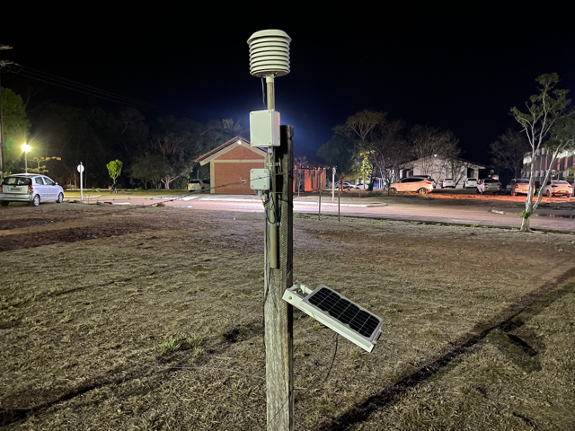
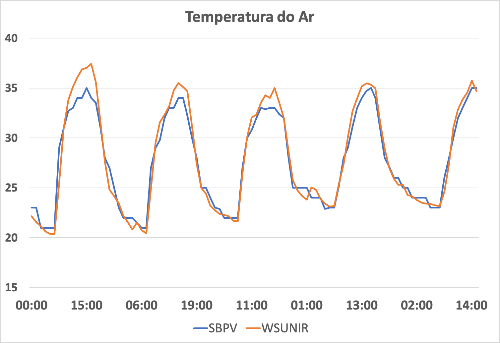
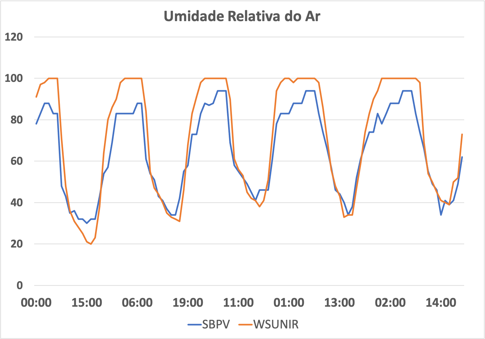
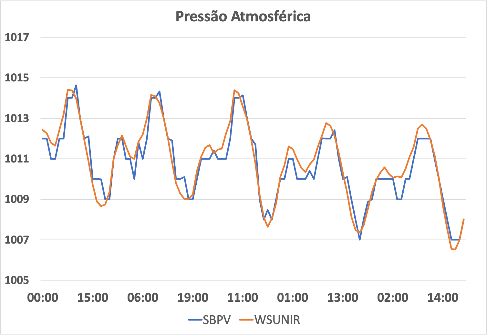
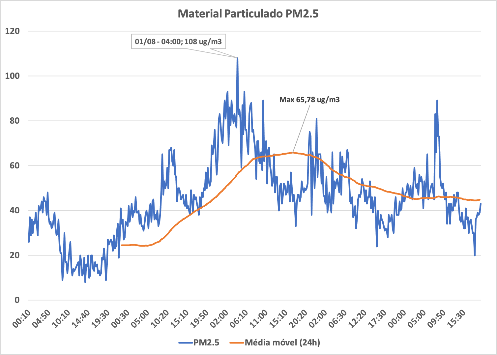
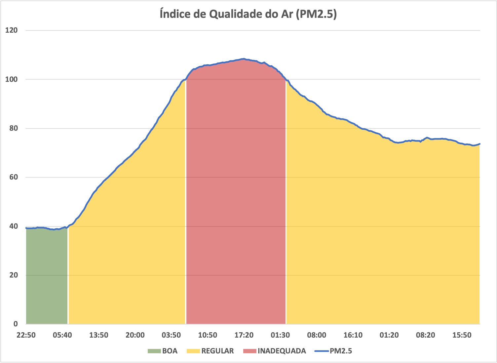

# Weather Station UNIR (under maintenance)
Prototype of an automatic weather station able to measure temperature, humidity, air pressure and particulate matter parameters, sending all data to ThingSpeak server.

The device is installed at Federal University of Rondônia Foundation's Campus and collect the environment's measures every minute, stores in a SD card and sends to a ThingSpeak server.

---
## Data Collected Comparison
The collected data (orange line) were compared with data from an official station (blue line) and the comparison is showed by the figures below.
### Temperature

---
### Humidity

---
### Pressure

---
## Particulate Matter
Three particulate's diameter were measured: 1.0 $\mu$ m, 2.5 $\mu$ m and 10.0 $\mu$ m. The method to determine the air quality index is based on moving average of particulate's concentration, and is defined by CONAMA - Conselho Nacional do Meio Ambiente, for each particulate matter's diameters. The PM2.5 concentration measured is showed by figure below.

The index for PM2.5 obtained at University is showed by figure below, where the good quality air is measured below of 40, and inappropriate above 100.
